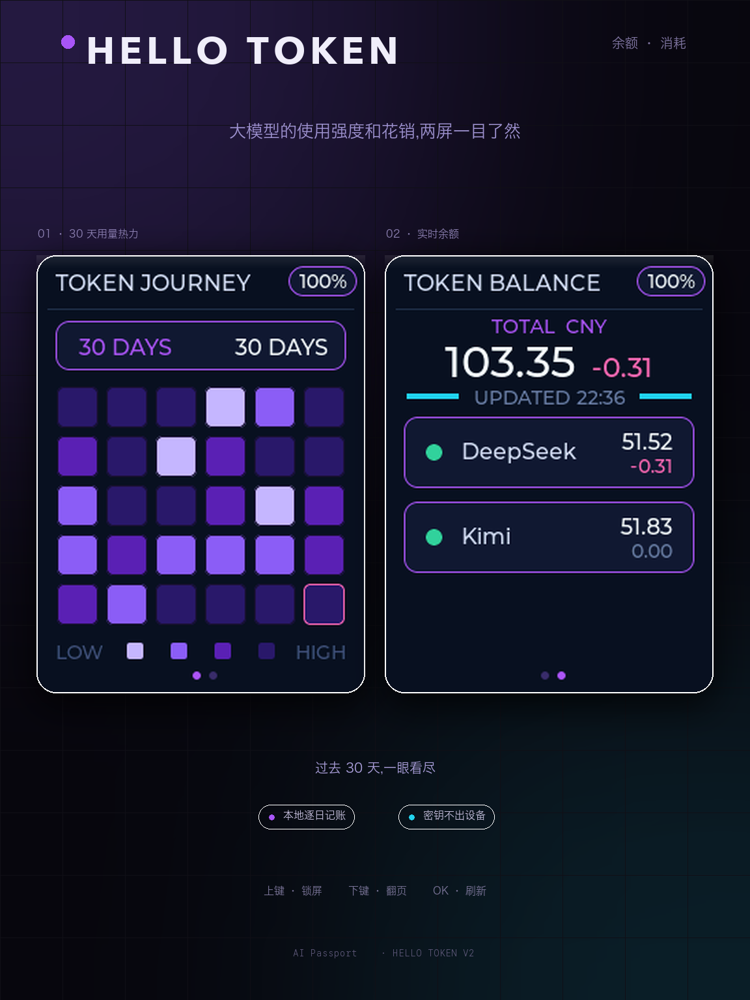
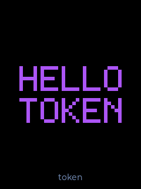
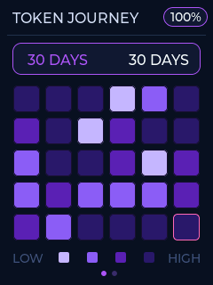
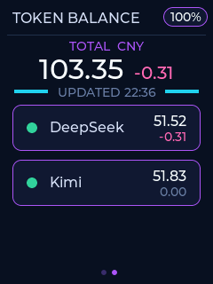

# TOKEN JOURNEY — FoloToy AI Passport 的 AI 余额追踪玩法

[English](README.md) | [简体中文](README.zh_CN.md)

**TOKEN JOURNEY** 是运行在 [FoloToy AI Passport](https://github.com/FoloToy/ai-passport) 上的社区玩法:把这张小巧的可穿戴卡片变成**随身 AI 花费看板**——最近 30 天消耗热力图、各平台余额、今日花费,全部在设备上呈现;你的 API Key **只存在设备里**。

本仓库基于官方 `FoloToy/ai-passport` 的 `main` 基线开发(MIT),新增代码同样以 MIT 许可发布。

<p align="center">
  
</p>

---

## 功能

| | |
|---|---|
| **TOKEN JOURNEY 页** | 最近 30 天消耗热力图(6 × 5 网格,旧→新,今天在右下角),紫→青色阶;每天的数值由设备本地日记账推算。 |
| **TOKEN BALANCE 页** | 总余额(CNY)+ 各平台余额与今日花费(负值玫红显示)。 |
| **锁屏** | 薄荷绿 "HELLO TOKEN" 点阵。短按 **UP** 锁屏/解锁;3 分钟无操作自动锁屏,分级调光。 |
| **按需联网** | Wi-Fi 仅在刷新时开启(约 2–8 秒),两页一次取回,取完即断。 |
| **SoftAP 配网门户** | 手机连接设备热点(`BAL-xxxx`),打开 `192.168.4.1`,填写 Wi-Fi 凭据、平台 API Key、可选昵称(锁屏显示)。 |
| **设备端逐日记账** | NVS 内 31 槽环形缓冲记录每日基线,消耗与热力图本地推算(UTC+8),不依赖任何云服务。 |
| **平台适配** | DeepSeek · Kimi,通过 `main/we_provider.c` 的适配器表可扩展。 |

### 按键

- 开机 → TOKEN JOURNEY 页(第 1 页)
- **DOWN** 短按 — 在 TOKEN JOURNEY ↔ TOKEN BALANCE 之间切换
- **OK** 短按 — 立即刷新(取数 + 记账,然后关闭 Wi-Fi)
- **UP** 短按 — 锁屏 / 解锁(锁屏态仅 UP 可解锁)
- **OK** 长按 — 返回 demo 菜单

## 屏幕实拍

设备真机截屏(240 × 320):

<p align="center">
  
  
  
</p>

从左到右:**HELLO TOKEN** 锁屏(短按 UP 解锁)、第 1 页 **TOKEN JOURNEY** —— 30 天消耗热力图(今天粉框标记)、第 2 页 **TOKEN BALANCE** —— 总余额与各平台余额、今日花费。

---

## 安装(无需开发环境)

1. 从最新 [Release](https://github.com/hellonick/ai-passport-token-journey/releases/latest) 下载 **`FoloToy-AI-Passport-full.bin`**。
2. 用官方网页刷机工具: <https://ai-passport.folotoy.cn/tools/web-flasher/> — 或用 esptool:

   ```bash
   esptool.py --chip esp32c3 --port /dev/cu.usbmodem* write_flash 0x0 FoloToy-AI-Passport-full.bin
   ```

3. 首次开机:进入菜单 → **Setup**,手机连接 `BAL-xxxx` 热点(密码 `12345678`),浏览器打开 `192.168.4.1`,填入 Wi-Fi 与 **DeepSeek / Kimi API Key**,按 **OK** 刷新即可。

> `full.bin` 是整片分区镜像,刷在 `0x0` 会**清空 NVS**——首次安装没有问题。若设备已在运行其他玩法且想保留配置,请只刷应用分区(`write_flash 0x10000 <app>.bin`)。

---

## 从源码构建

- ESP-IDF **5.5.3**,芯片 **ESP32-C3**(无 PSRAM,只用小缓冲),8 MB Flash。
- 保留官方分区契约:3 MB 应用上限、`cardid` @ `0x356000`、永久 Recovery @ `0x700000`、开机 5 秒 UP 键进入 Recovery——不得移动或擦除。

```bash
# 加载 ESP-IDF 5.5.3 环境
source $IDF_PATH/export.sh
idf.py build
# 发布镜像(自 0x0 合并)
idf.py merge-bin -o "$PWD/build/FoloToy-AI-Passport-full.bin"
python3 tools/verify_firmware.py "$PWD/build"
```

仓库门禁(仓库检查 + host 测试 + 固件校验):

```bash
./tools/validate.sh --static    # 仓库检查 + host 测试
./tools/validate.sh --firmware  # 干净构建 + 合并镜像校验
./tools/validate.sh             # 全量门禁
```

---

## 仓库结构

本仓库 = 官方 `main` 基线 + 本玩法。玩法相关代码:

| 路径 | 用途 |
|---|---|
| `main/app_balance.c` | 双页看板(TOKEN JOURNEY / TOKEN BALANCE)、锁屏、调光、记账逻辑 |
| `main/we_cfg.c` / `we_cfg.h` | 配置模型:Wi-Fi 档案、平台 Key、昵称(NVS `cfg`) |
| `main/we_hist.h` | 逐日记账数据模型,`app_balance.c` 与备份模块共用(NVS `balhist`) |
| `main/we_backup.c` / `we_backup.h` | 配置 + 记录的整份 JSON 备份/恢复(`GET /backup`、`POST /restore`) |
| `main/we_portal.c` / `we_portal.h` | 配网门户:优先用已存 WiFi 档案接入局域网,失败回落 SoftAP |
| `main/we_provider.c` / `we_provider.h` | 平台适配:HTTPS 直连官方余额接口 |
| `main/lock_hello.h` | 锁屏 "HELLO TOKEN" 点阵位图 |
| `main/fap_screenshot.c` / `.h` | 官方发布流程使用的串口截屏协议 |
| `components/bsp/src/bsp_battery.c` | CW2017 电量计 profile(不写则 SOC 恒为 `--`) |
| `scripts/patch-esp-lvgl-port.py` | LVGL port 组件补丁(重拉组件后需重新执行) |
| `tests/test_we_cfg.c`, `tests/test_we_provider.c` | 纯逻辑层 host 测试 |

## 隐私

- API Key 由你在配网时输入,**只存设备 NVS**;固件与仓库不含任何硬编码密钥。
- 固件只连接:你的 Wi-Fi、所配置平台的官方余额接口、以及(可选)SNTP 校时服务器。无遥测、无个人数据采集。
- **不要**把别人的配置 NVS 备份刷进自己的设备——里面含有对方的 Key。

## 许可与血缘

MIT License — 见 [LICENSE](LICENSE)。上游版权 © 2026 FoloToy。玩法在官方基线之上开发,完整改动见提交历史。
